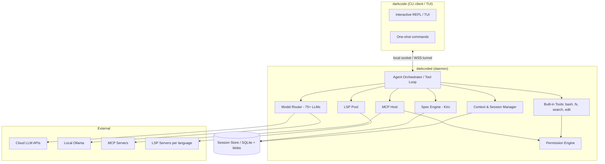
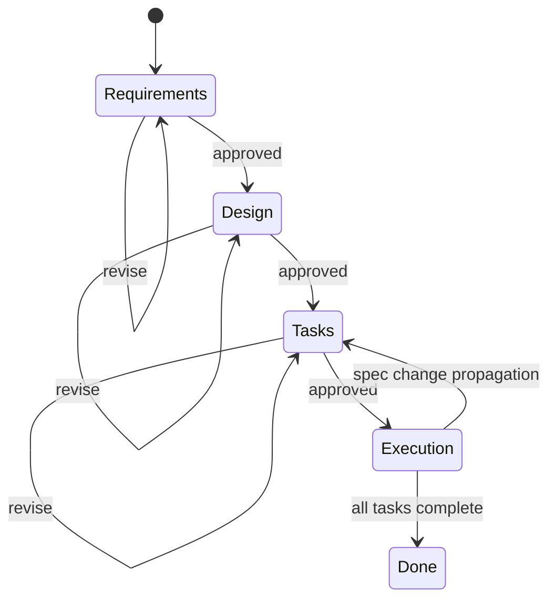
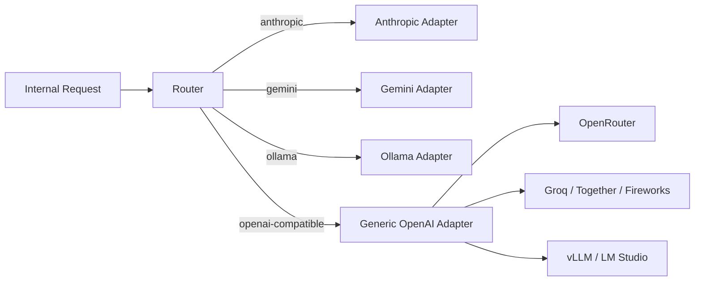
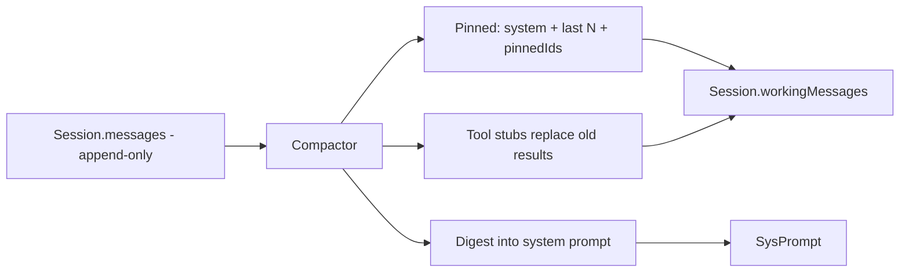
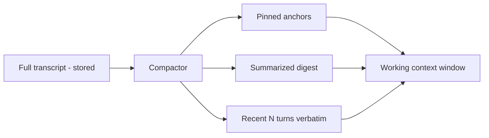
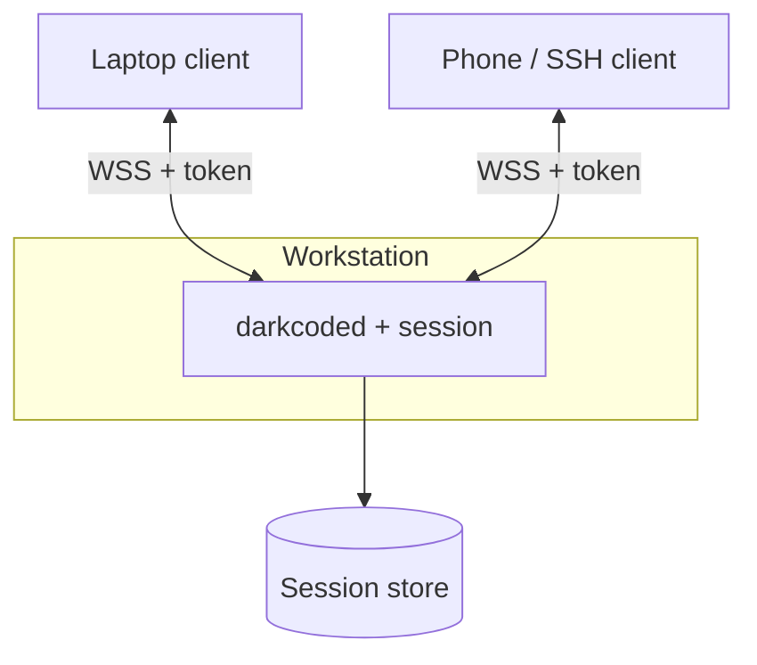
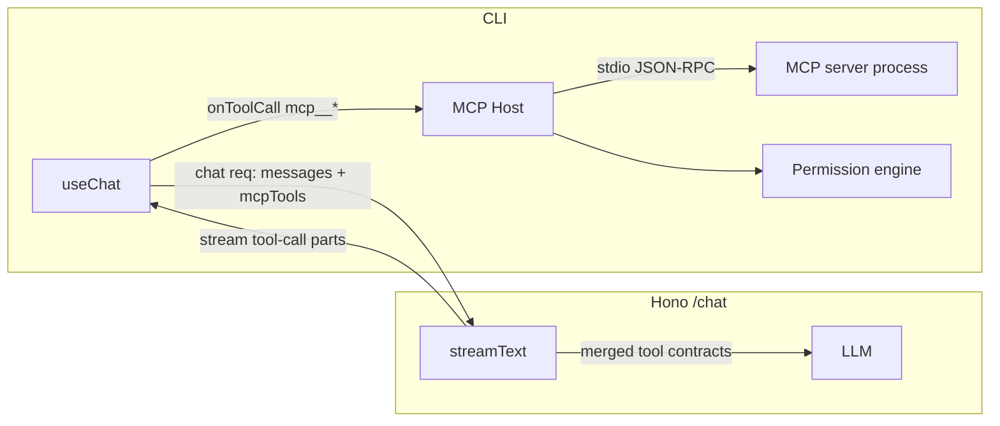
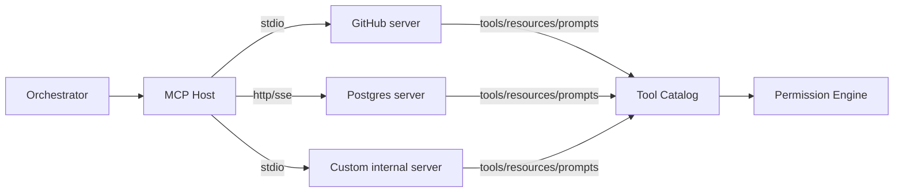
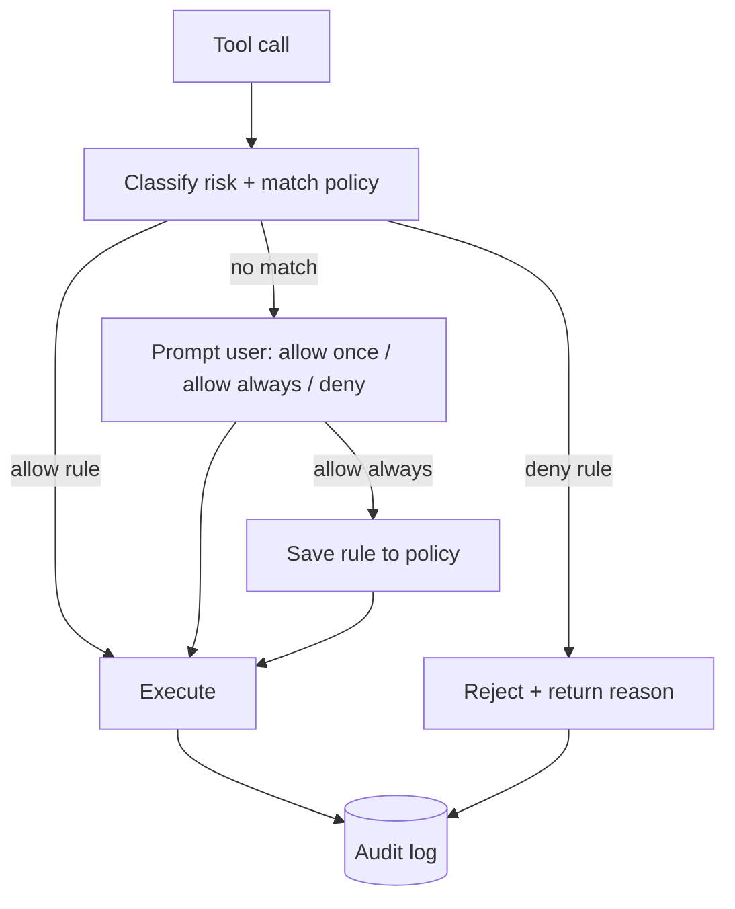

# DarkCode CLI — Feature Integration Plan

**Status:** v1.1 — adjusted to the as-built stack (Hono server + Bun/OpenTUI CLI + Postgres/Prisma). The daemon design from v1.0 was dropped; features layer onto the existing server/CLI split.
**Owner:** Jose
**Scope:** Integrate four feature pillars into the DarkCode CLI agentic coding tool — (1) Kiro-style spec-driven development, (2) multi-model support with IDE-like features, (3) context & session management, (4) extensibility via MCP and a permission system.

### Implementation status (as of v1.1)

| Phase | Status |
|---|---|
| P0 Foundations | ✅ shipped (server+CLI variant, Postgres+Prisma, OpenTUI/React, AI SDK streaming) |
| P1 Multi-model + core tools | ✅ partial — Anthropic / OpenAI / OpenAI-compatible (DeepSeek) + 7 client-side tools + fallback-on-credits-depleted; Gemini/Ollama adapters deferred |
| P2 Permission engine | ✅ shipped — engine, bash classifier, fs guards, prompt dialog, JSONL audit, `/audit` + `/permissions` viewers, `/yolo` / `/auto-edit` / `/safe` posture commands, bash env scrubbing for credentials |
| P3 Context & session mgmt | ✅ shipped — see §7 for the as-built design |
| P4 LSP integration | ❌ not started |
| P5 Kiro spec engine | ❌ not started |
| P6 MCP host | ❌ not started |
| P7 Remote attach | ❌ not started (HTTP+Clerk auth covers single-device; multi-attach to a live session deferred) |
| P8 Hardening | ❌ not started |

---

## 1. Vision & Scope

DarkCode CLI becomes a terminal-native agentic coding tool that combines **disciplined spec-driven planning** (Kiro), **model freedom** (75+ cloud + local LLMs), **durable sessions** (compaction, continuation, remote attach), and **safe extensibility** (MCP tools + a permission gate over bash/file ops).

The design goal is that a developer can: describe a feature in natural language → get an approved spec → have the agent implement it task-by-task → using any model they choose → across multiple devices → while every dangerous operation passes through an auditable permission layer.

### Non-goals (v1)
- No GUI/desktop app. Terminal + optional editor LSP hooks only.
- No proprietary model hosting. DarkCode is a client/orchestrator, not an inference provider.
- No multi-tenant SaaS in v1. Single-user, self-hosted daemon for remote attach.

---

## 2. Architecture Overview

> **v1.1 update — no daemon.** The shipped design is a Hono **server** (sessions, model routing, billing, auth) plus a Bun/OpenTUI **CLI** that streams from it over HTTP+SSE. Tool dispatch is client-side: the server only declares tool schemas, the CLI executes bash / fs / search inside the user's actual `process.cwd()` and posts results back. Future LSP and MCP processes also run **CLI-side** so the server stays stateless. Remote attach (Phase 7) will graft a separate WSS endpoint onto the same server; the daemon model from v1.0 is no longer the path.

The v1.0 daemon diagram below is preserved for historical reference. The as-built mapping: `darkcoded → packages/server` (Hono), `darkcode → packages/cli` (OpenTUI/React), `Session Store → Postgres via Prisma`, `Tools/Perm/LSP/MCP → packages/cli/src/lib` (all client-side).



**Why a daemon?** Remote attach, session persistence, warm LSP servers, and warm model connections all require a process that outlives a single terminal session. The CLI client becomes a stateless view onto daemon state.

---

## 3. Tech Stack (as built)

| Concern | Choice |
|---|---|
| Core language | **TypeScript on Bun** (server + CLI) |
| Server | **Hono** with AI SDK `UIMessageStreamResponse` (HTTP+SSE streaming) |
| TUI | **OpenTUI + React** with `react-router` (memory router) |
| Session store | **Postgres via Prisma** — `Session.messages` Json column holds the full `UIMessage[]` |
| Auth | **Clerk** OAuth (PKCE browser flow) + dual-token server-side session |
| Billing | **Polar** credit metering via `darkcode_usage` events |
| Model SDKs | **Vercel AI SDK** — `@ai-sdk/anthropic`, `@ai-sdk/openai`, `createOpenAI` w/ `baseURL` for OpenAI-compatible providers |
| MCP (planned) | Official `@modelcontextprotocol/sdk`, hosted **CLI-side** |
| LSP (planned) | `vscode-languageserver-protocol` client, hosted **CLI-side** |
| Permissions | Bespoke engine at `packages/cli/src/lib/permissions/` (Phase 2) |
| Packaging | `bun build` + `bun link` for the `darkcode` executable |

---

## 4. Repository & Module Layout

```
darkcode/
├── packages/
│   ├── cli/                              # OpenTUI/React TUI (BUN)
│   │   └── src/
│   │       ├── components/{dialogs,messages,command-menu,...}
│   │       ├── hooks/                    # useChat wrapper, etc.
│   │       ├── layouts/                  # root layout + theming
│   │       ├── lib/
│   │       │   ├── api-client.ts         # talks to Hono server
│   │       │   ├── auth.ts / oauth.ts    # Clerk PKCE flow
│   │       │   ├── api-keys.ts           # BYOK storage at ~/.darkcode/api-keys.json
│   │       │   ├── local-tools.ts        # CLIENT-SIDE tool dispatch (bash/fs/search)
│   │       │   ├── permissions/          # Phase 2 engine (policy, classifier, audit)
│   │       │   ├── lsp/                  # planned (Phase 4) — runs CLI-side
│   │       │   └── mcp/                  # planned (Phase 6) — runs CLI-side
│   │       ├── providers/                # dialog, keyboard, theme, toast, permission-prompt
│   │       └── screens/                  # home, new-session, session
│   ├── server/                           # Hono API (BUN)
│   │   └── src/
│   │       ├── index.ts                  # mounts /auth /billing /sessions /chat /health
│   │       ├── routes/                   # chat.ts (heart of the system), sessions.ts, ...
│   │       ├── lib/                      # models.ts, polar.ts, credits.ts, audit.ts, ...
│   │       ├── middleware/               # requireAuth, rate-limit
│   │       └── system-prompt.ts          # buildSystemPrompt({ mode, model })
│   ├── database/                         # Prisma schema + generated client
│   └── shared/                           # cross-package contracts
│       ├── schemas.ts                    # tool contracts (PLAN/BUILD)
│       └── models.ts                     # model registry (the ONE source of truth)
├── .darkcode/                            # per-project config (planned)
│   ├── permissions.json                  # Phase 2 project policy
│   ├── specs/                            # Kiro specs (planned, Phase 5)
│   ├── steering/                         # always-on context docs (planned)
│   └── mcp.json                          # MCP server declarations (planned, Phase 6)
└── ~/.darkcode/                          # global state
    ├── permissions.json                  # global policy
    ├── api-keys.json                     # BYOK secrets
    ├── audit.jsonl                       # permission audit log
    └── tokens.json                       # Clerk session
```

---

## 5. Pillar 1 — Spec-Driven Development (Kiro Integration)

### 5.1 Goal
Bring Kiro's three-phase workflow — **Requirements → Design → Tasks** — into DarkCode as a first-class mode, with EARS-notation acceptance criteria, approval gates, and dependency-aware task execution.

### 5.2 Spec directory format
Each feature gets a folder under the project root:

```
.darkcode/specs/<feature-name>/
├── requirements.md   # user stories + EARS acceptance criteria
├── design.md         # architecture, schemas, sequence diagrams
├── tasks.md          # discrete, trackable, dependency-linked tasks
└── spec.json         # machine-readable index (phase state, approvals, task graph)
```

`spec.json` is the source of truth for state; the `.md` files are the human-editable surface. The Spec Engine keeps them in sync (parse-on-read, regenerate-on-write).

### 5.3 EARS notation support
Requirements are written as testable statements. The engine validates each acceptance criterion matches one of the EARS templates:

| Template | Pattern |
|---|---|
| Ubiquitous | THE SYSTEM SHALL `<behavior>` |
| Event-driven | WHEN `<trigger>` THE SYSTEM SHALL `<behavior>` |
| State-driven | WHILE `<state>` THE SYSTEM SHALL `<behavior>` |
| Optional feature | WHERE `<feature included>` THE SYSTEM SHALL `<behavior>` |
| Unwanted behavior | IF `<condition>` THEN THE SYSTEM SHALL `<behavior>` |
| Complex | Combinations of the above |

A linter (`darkcode spec lint`) flags criteria that don't parse as EARS and suggests rewrites via the active model.

### 5.4 Workflow variants
Match Kiro's options:
- **Requirements-First** (default): behavior → design → tasks.
- **Design-First**: start from architecture, derive requirements + tasks.
- **Quick Plan**: run all three phases with no approval gates (for well-understood features). Collect clarifying answers up front.
- **Bugfix Spec**: root-cause → fix design → validation tasks (regression-focused).

### 5.5 Approval gates
Between phases the engine **blocks** until explicit approval. State machine:



Approval is recorded in `spec.json` with timestamp + the model/commit used, so the spec is auditable. Quick Plan sets `approval_mode: "auto"`.

### 5.6 tasks.md format & dependency waves
Tasks are checkboxes with metadata so the orchestrator can build a dependency graph and run independent tasks in **waves** (Kiro-style concurrent execution):

```markdown
## Task List
- [ ] 1. Scaffold session store schema  <!-- id: T1, deps: [], req: [R1, R2] -->
- [ ] 2. Implement SQLite repositories  <!-- id: T2, deps: [T1], req: [R2] -->
- [ ] 3. Add blob store for artifacts    <!-- id: T3, deps: [T1], req: [R3] -->
- [ ] 4. Wire session continuation       <!-- id: T4, deps: [T2, T3], req: [R4] -->
```

- Wave 1: T1 → Wave 2: T2, T3 (concurrent) → Wave 3: T4.
- Each task links back to requirement IDs so coverage is verifiable.
- Real-time status: `pending → in_progress → done | blocked | failed`, streamed to the client.

### 5.7 Spec change propagation
When a requirement changes, the engine re-runs an analysis pass that proposes diffs to `design.md` and `tasks.md` (new tasks, invalidated tasks), surfaced for approval rather than applied silently.

### 5.8 CLI surface (Pillar 1)
```
darkcode spec new <name> [--design-first | --quick]
darkcode spec status <name>
darkcode spec approve <name> --phase requirements|design|tasks
darkcode spec lint <name>
darkcode spec run <name> [--task T3 | --all] [--max-parallel N]
darkcode spec propagate <name>      # re-sync after manual .md edits
```

---

## 6. Pillar 2 — Multi-Model Support + IDE-Like Features

### 6.1 Model registry (75+ LLMs incl. local Ollama)
A declarative registry maps model IDs to provider adapters. Providers normalize to a common internal request/response shape (messages, tools, streaming, token usage).

**Adapter strategy:** most providers are OpenAI-compatible, so one `OpenAICompatibleAdapter` covers the long tail (OpenRouter, Groq, Together, Fireworks, DeepSeek, Mistral, local vLLM, LM Studio, etc.). Native adapters only where the protocol diverges (Anthropic Messages, Google Gemini, AWS Bedrock, Ollama).



**Ollama specifics:** detect local Ollama at `http://localhost:11434`, list installed models via `/api/tags`, stream via `/api/chat`. Surface them automatically in `darkcode models` with a `local` tag. Handle the no-network case gracefully (local-only mode).

### 6.2 Model selection & routing
- **Per-session default** + **per-task override** (e.g., a cheap local model for planning, a frontier model for hard implementation).
- **Auto mode** (optional): route by task type / context size / cost ceiling — e.g., long-context tasks → a long-context model; quick edits → fast local model.
- **Fallback chains**: on rate-limit / error, fall through to the next model in the chain.

Registry entry shape:
```jsonc
{
  "id": "openrouter/qwen-2.5-coder-32b",
  "provider": "openai-compatible",
  "endpoint": "https://openrouter.ai/api/v1",
  "context_window": 131072,
  "supports_tools": true,
  "supports_streaming": true,
  "cost_per_1m": { "input": 0.18, "output": 0.18 },
  "tags": ["coder", "cloud"]
}
```

### 6.3 IDE-like feature: automatic LSP integration
A warm **LSP pool** in the daemon gives the agent the same signal a human gets in an IDE — go-to-definition, find-references, hover types, and **live diagnostics**.

- On project open, detect languages and auto-launch the matching language servers (`tsserver`, `pyright`, `rust-analyzer`, `gopls`, etc.) via a server registry.
- Expose LSP capabilities to the agent as **tools**: `lsp.definition`, `lsp.references`, `lsp.hover`, `lsp.diagnostics`, `lsp.rename`, `lsp.symbols`.
- **Diagnostics feedback loop:** after every file edit, the orchestrator requests diagnostics for the changed file and feeds errors/warnings back into the agent's context so it can self-correct before declaring a task done.
- LSP servers stay warm across turns (big latency win vs. cold-starting per request).

### 6.4 IDE-like feature: session persistence
- Every turn (user message, model response, tool call, tool result, diagnostics) is written to the session store immediately, not just at session end.
- A session can be **resumed** byte-for-byte after a crash, restart, or device switch (see Pillar 3).

### 6.5 CLI surface (Pillar 2)
```
darkcode models                      # list available (cloud + local)
darkcode models pull <ollama-model>  # convenience wrapper for ollama pull
darkcode use <model-id>              # set session default
darkcode use <model-id> --for design # override per spec phase / task type
darkcode lsp status                  # show running language servers
```

---

## 7. Pillar 3 — Context & Session Management

### 7.1 Automatic context compaction (v1.1 design — as built)

Long agent sessions overflow the model context window. DarkCode compacts proactively, **server-side**, before each `streamText` call.

**Data model:** `Session.messages` (the raw transcript, append-only, never edited by compaction) is joined by `Session.workingMessages` (what is actually sent to `streamText`). A `compactionSummary` string holds the latest digest; `compactionAt` timestamps it; `pinnedMessageIds: string[]` lets specific messages survive the dropper. On first compaction `workingMessages` diverges from `messages`; on every subsequent assistant turn both are appended.

**Triggering:** at the top of `POST /chat`, estimate `projectedNextRequestTokens = systemPromptTokens + estimateTokens(workingMessages) + estimateTokens(incomingUserMessage) + 4096`. If `projected / model.contextWindow >= 0.75`, compact synchronously before invoking the model. Also exposed as `POST /sessions/:id/compact` (the CLI's `/compact` command).

**Estimator:** 4-char/token heuristic. Cheap, deterministic, and good enough for threshold gating — Polar billing still uses the provider's exact `usage`.

**Strategy (layered, in order):**
1. **Pin** the system prompt, the last `N=10` turns verbatim, and anything in `pinnedMessageIds`.
2. **Summarize** every older turn with the active session model (a follow-up slice routes this to a cheaper summarizer). The digest is structured: *decisions / files touched / open threads / unresolved errors*.
3. **Drop** tool results inside the summarized range — replace each with a stub retaining only `toolCallId` + `toolName` so the message stream stays well-formed.
4. **Promote** the digest into the system prompt as a `## Prior conversation digest` block (it survives the next compaction without taking a turn slot).



**Overflow refusal:** if `projected > contextWindow` even after compaction (e.g., a single 100k tool output), the route returns `400` with a structured error rather than letting upstream `AI_APICallError` leak out.

**Streaming UX:** compaction emits a `{ type: "compaction", droppedCount, summary }` metadata frame. The CLI renders a `CompactionDivider` (`— summarized 23 earlier turns —`) inline in the message list, and the status bar shows `tokens / contextWindow (NN%)` with amber@75% / red@90%.



### 7.2 Session continuation
- `darkcode resume` reattaches to the most recent session; `darkcode resume <id>` to a specific one.
- Sessions survive daemon restarts (state in SQLite + blobs).
- On resume, the daemon rehydrates: working context, active spec/task, model selection, and re-warms LSP servers for the project.

### 7.3 Remote attach / multi-device access
The daemon can expose an **attach server** so a second device (laptop, phone-SSH, another workstation) can connect to the same live session.

**Design:**
- Daemon listens on a configurable port with **WebSocket-over-TLS**.
- Auth via a device-paired token (generated by `darkcode serve --pair`, scanned/entered on the second device). Tokens are scoped and revocable.
- Multiple clients can attach to one session; the daemon **broadcasts** turn events to all attached clients (read-along) and serializes input commands (one writer at a time, with a soft lock / takeover prompt).
- Default transport remains the local Unix socket; remote is opt-in and off by default for safety.



> Security note: remote attach is a network-exposed surface. It must be gated behind TLS, token auth, and ideally bound to a tailnet/VPN or `localhost`-tunnel by default rather than the open internet.

### 7.4 Session data model (as built + Phase 3 additions)

The shipped schema is denormalized — a single `Session` row holds the full `UIMessage[]` in a Json column rather than per-turn tables. Phase 3 extends it:

```prisma
model Session {
  id                String   @id @default(cuid())
  userId            String
  title             String?
  messages          Json     @default("[]")  // raw transcript, append-only
  workingMessages   Json     @default("[]")  // NEW — what we send to streamText
  compactionSummary String?                  // NEW — latest digest
  compactionAt      DateTime?                // NEW — last compaction timestamp
  pinnedMessageIds  String[] @default([])    // NEW — survive the dropper
  createdAt         DateTime @default(now())
  lastActivityAt    DateTime @default(now())
}
```

The v1.0 normalized layout (`turns`, `tool_calls`, `context_snapshots`, `attachments`) is deferred to Phase 7 if remote attach actually needs per-turn querying.

### 7.5 CLI surface (Pillar 3)
```
darkcode resume [<session-id>]
darkcode sessions list
darkcode compact [--now]            # force compaction
darkcode serve --pair               # enable remote attach, mint device token
darkcode attach <host> --token <t>  # connect from a second device
darkcode sessions revoke <device>   # kill a device token
```

---

## 8. Pillar 4 — Extensibility (MCP + Permission System)

### 8.1 MCP host (v1.1 — M1 slice)

DarkCode acts as an **MCP host** to gain external tools (GitHub, databases, browsers, internal APIs, etc.). Because tool dispatch is already client-side in this repo, the host lives **in the CLI**, not the server. The server stays stateless about MCP — it just receives discovered tool schemas in each chat request and forwards them to `streamText` + `validateUIMessages`.

**M1 (this slice):**
- **stdio transport only.** Streamable HTTP transport is deferred.
- **Project-level `.darkcode/mcp.json` only.** Global `~/.darkcode/mcp.json` deferred.
- **Lazy connect.** Spawn the child process on first invocation; cache the client + tool catalog per-process for the rest of the CLI session.
- **Tool naming on the wire:** `mcp__<server>__<tool>` (Anthropic / Claude Desktop convention — no dots, safe across provider validators).
- **Discovery flow:** at session start the CLI runs `tools/list` against each declared server and stashes the JSON Schema. The list is bundled into every chat request body so the server can merge it with `getToolContracts(mode)`.
- **Dispatch:** `useChat`'s `onToolCall` recognizes the `mcp__` prefix and routes through the MCP host (`tools/call`) instead of `executeLocalTool`. The host normalizes the result into the same `{ stdout?, content?, error? }` shape the local tools return.
- **Permission gate:** every MCP call passes through the existing engine via a new `{ kind: "mcp", toolName, args }` op. Defaults to **ask** unless an allow/deny rule matches. "Allow always" writes `mcp__github__create_issue` (the exact tool name) to `permissions.json` under `mcp.allow`.

**Deferred to follow-up slices (M2+):**
- Streamable HTTP transport
- Global `~/.darkcode/mcp.json`
- Server lifecycle: health probes, restart-on-crash, idle shutdown
- `darkcode mcp list / add / remove / logs` commands
- Tool name collision handling across servers
- Resources & prompts (M1 wires only tools)
- Tool catalog change notifications (`notifications/tools/list_changed`)



**Server declarations** in `.darkcode/mcp.json`:
```jsonc
{
  "servers": {
    "github": { "transport": "stdio", "command": "npx", "args": ["-y", "@modelcontextprotocol/server-github"] },
    "postgres": { "transport": "http", "url": "https://localhost:8931/mcp" }
  }
}
```
- On startup the host launches/connects declared servers, performs the MCP handshake, and **registers their tools** into the orchestrator's tool catalog with a namespaced prefix (`mcp.github.create_issue`).
- Servers are managed: health checks, restart-on-crash, lazy start (connect on first use), and clean shutdown.



### 8.2 Permission system (bash + file + MCP ops)
Every side-effecting operation routes through a central **Permission Engine** before execution. This covers built-in tools (`bash`, file write/delete, network fetch) **and** MCP tools.

**Decision flow for each tool call:**


**Policy model** (declarative, in `.darkcode/permissions.toml`):
```toml
[bash]
allow = ["git status", "git diff", "npm test", "ls *", "cat *"]
deny  = ["rm -rf *", "curl * | sh", ":(){ :|:& };:", "sudo *"]
ask   = ["git push *", "npm publish *"]      # everything else prompts

[fs]
allow_write = ["src/**", "tests/**", ".darkcode/specs/**"]
deny_write  = ["~/.ssh/**", ".env", "**/*.pem", "/etc/**"]

[mcp]
ask = ["mcp.github.*", "mcp.postgres.write*"]
allow = ["mcp.postgres.read*"]
```

**Key properties:**
- **Default-deny for unmatched destructive ops** → prompts the user (allow once / allow always / deny). "Allow always" writes a rule.
- **Modes:** `--mode plan` (read-only, no side effects), `--mode auto-edit` (file edits auto-allowed, bash/network still gated), `--mode yolo` (auto-allow everything — explicit opt-in, loud banner).
- **Bash sandboxing:** run commands in a constrained subshell with a working-directory jail and optional network-off flag; pattern-match command strings against allow/deny (with shell-parsing, not naive substring matching, to resist obfuscation).
- **File guards:** path-glob allow/deny lists; block writes outside the project root unless explicitly allowed; protect secrets/dotfiles by default.
- **Audit log:** every decision (allowed/denied/prompted, by which policy, with args + result hash) is written to the store and queryable via `darkcode audit`.

### 8.3 CLI surface (Pillar 4)
```
darkcode mcp list | add <name> | remove <name> | logs <name>
darkcode tools                       # show full tool catalog (built-in + MCP)
darkcode permissions show
darkcode permissions allow "<rule>"  # add an allow rule
darkcode audit [--session <id>] [--since 1h]
darkcode --mode plan|auto-edit|yolo  # session-wide permission posture
```

---

## 9. Cross-Cutting Concerns

### 9.1 Configuration precedence
`CLI flags > project .darkcode/config.toml > global ~/.darkcode/config.toml > defaults`. Secrets (API keys) live only in the global config or env vars, **never** in committed project config.

### 9.2 Steering / always-on context
A `.darkcode/steering/` folder (analogous to `CLAUDE.md`) holds always-injected project context — conventions, architecture notes, do/don't rules — kept small and pinned during compaction.

### 9.3 Observability
Structured logs, per-turn token + cost accounting (surfaced in the TUI footer), and an optional local metrics view (`darkcode stats`).

### 9.4 Security posture summary
- Remote attach: TLS + revocable device tokens, off by default, bind to loopback/tailnet first.
- Permission engine is **mandatory** — there is no path for a tool to execute without passing it (yolo mode is an explicit policy decision, still logged).
- Secrets redaction in logs and in context sent to models.

---

## 10. Implementation Roadmap

Phases are ordered to deliver a usable agent early, then layer richness. Each phase has trackable tasks; dependencies noted so independent work can run in parallel.

### Phase 0 — Foundations (daemon + client skeleton)
- [ ] Monorepo + package scaffolding (`cli`, `daemon`, `core`, `store`)  <!-- deps: [] -->
- [ ] Daemon ↔ client transport over Unix socket (streaming)  <!-- deps: P0.1 -->
- [ ] SQLite store + migrations + repositories  <!-- deps: P0.1 -->
- [ ] Minimal agent tool-loop with one model + one tool (read file)  <!-- deps: P0.2, P0.3 -->
- [ ] Basic ink TUI with streaming output  <!-- deps: P0.2 -->

### Phase 1 — Multi-model + core tools
- [ ] Model registry + generic OpenAI-compatible adapter  <!-- deps: P0.4 -->
- [ ] Native adapters: Anthropic, Gemini, Ollama  <!-- deps: P1.1 -->
- [ ] `models` / `use` commands + fallback chains  <!-- deps: P1.1 -->
- [ ] Built-in tools: bash, fs read/write/edit, grep, glob, fetch  <!-- deps: P0.4 -->

### Phase 2 — Permission system (gates everything from here)
- [ ] Permission engine + policy parser (`permissions.toml`)  <!-- deps: P1.4 -->
- [ ] Interactive prompts (allow once/always/deny) + rule persistence  <!-- deps: P2.1 -->
- [ ] Bash classifier with shell-aware parsing + jail  <!-- deps: P2.1 -->
- [ ] File path guards + secret protection  <!-- deps: P2.1 -->
- [ ] Audit log + `darkcode audit`  <!-- deps: P2.1 -->
- [ ] Permission modes: plan / auto-edit / yolo  <!-- deps: P2.2 -->

### Phase 3 — Context & session management
- [x] Per-turn persistence (full transcript) — `Session.messages` Json column
- [x] `sessions list` + rehydration via sessions dialog
- [x] Schema: add `workingMessages` / `compactionSummary` / `compactionAt` / `pinnedMessageIds`
- [x] Server: `lib/compaction.ts` (pin → summarize → drop) + `lib/token-estimate.ts`
- [x] Server: `contextWindow` per model in `@darkcode/shared`
- [x] Server: chat route uses `workingMessages`, auto-compacts at 75%, refuses on overflow
- [x] Server: `## Prior conversation digest` block in system prompt
- [x] Server: `POST /sessions/:id/compact`
- [x] CLI: `/compact` command, `CompactionDivider` in message list, status bar window%

### Phase 4 — IDE-like features (LSP)
- [ ] LSP pool + server registry + auto-launch by language  <!-- deps: P0.4 -->
- [ ] LSP tools exposed to agent (definition/references/hover/symbols/rename)  <!-- deps: P4.1 -->
- [ ] Post-edit diagnostics feedback loop into context  <!-- deps: P4.1, P3.1 -->
- [ ] Warm-server reuse across turns + on resume  <!-- deps: P4.1, P3.2 -->

### Phase 5 — Kiro spec-driven development
- [ ] Spec directory format + `spec.json` state machine  <!-- deps: P0.3 -->
- [ ] EARS linter + requirements generation  <!-- deps: P5.1, P1.1 -->
- [ ] Design + tasks generation with approval gates  <!-- deps: P5.2 -->
- [ ] Workflow variants: requirements-first / design-first / quick / bugfix  <!-- deps: P5.3 -->
- [ ] tasks.md dependency graph + concurrent wave execution  <!-- deps: P5.3, P2.1 -->
- [ ] Spec change propagation pass  <!-- deps: P5.5 -->

### Phase 6 — Extensibility (MCP)
- [ ] M1: stdio transport, lazy spawn, project `.darkcode/mcp.json`
- [ ] M1: tool discovery + chat-request injection into server's tool contracts
- [ ] M1: `mcp__server__tool` dispatch from `useChat.onToolCall`
- [ ] M1: permission engine `mcp` op kind + `policy.mcp.{allow,deny,ask}`
- [ ] M2: Streamable HTTP transport
- [x] M2: global `~/.darkcode/mcp.json` layered over project
- [ ] M2: health probes, restart-on-crash, idle shutdown
- [x] M2: tool catalog viewer (`/mcp` dialog); `darkcode mcp list/add/remove/logs` deferred
- [ ] M2: resources & prompts, tool list-changed notifications

### Phase 7 — Remote attach (multi-device)
- [ ] WSS attach server + TLS  <!-- deps: P0.2, P3.2 -->
- [ ] Device pairing tokens (mint/scope/revoke)  <!-- deps: P7.1 -->
- [ ] Multi-client broadcast + single-writer locking  <!-- deps: P7.1 -->
- [ ] `serve` / `attach` / `revoke` commands + security defaults  <!-- deps: P7.2 -->

### Phase 8 — Hardening & polish
- [ ] End-to-end test suite (see §11)
- [ ] Single-binary packaging + install script
- [ ] Docs + `--help` for every command
- [ ] Cost/latency benchmarks across model providers

**Critical path:** P0 → P1 → P2 → (P3, P4, P5, P6 in parallel) → P7 → P8. Permissions (P2) intentionally precede everything side-effecting.

---

## 11. Testing & QA Strategy

| Layer | Approach |
|---|---|
| Unit | Adapters, EARS parser, permission classifier, compaction logic. The bash classifier and path guards get adversarial test vectors (obfuscated `rm -rf`, symlink escapes, `$(...)` injection). |
| Contract | Each model adapter tested against a recorded/mock provider response + one live smoke test per provider. |
| Integration | Full tool-loop against a fixture repo: spec → tasks → execution with a deterministic local model. |
| LSP | Spin up real `tsserver`/`pyright` against fixtures; assert diagnostics feedback loop catches injected errors. |
| Security | Permission engine fuzzing; remote-attach auth/token tests; secret-redaction assertions on logs and outbound context. |
| Resilience | Kill daemon mid-task → assert clean resume; provider rate-limit → assert fallback chain. |

---

## 12. Risks & Mitigations

| Risk | Mitigation |
|---|---|
| Permission bypass via shell obfuscation | Parse the shell command into an AST/token stream, not substring match; default-deny on parse failure. |
| Remote attach exposed to internet | Off by default; loopback/tailnet binding first; TLS + revocable tokens; loud warnings on `0.0.0.0` bind. |
| Spec workflow becomes bureaucratic overhead | Offer Quick Plan + a lightweight steering-doc mode; calibrate rigor to task size (full spec for durable features, none for one-off fixes). |
| Adapter sprawl (75+ models) | Lean on the OpenAI-compatible shim; only write native adapters where protocols truly diverge. |
| Compaction loses important context | Never discard raw transcript; compaction only changes the window; allow `--no-compact` and manual pinning. |
| LSP server zoo / cold-start latency | Warm pool in daemon; lazy-launch per detected language; graceful degradation when a server is missing. |

---

## 13. Open Questions

1. **Daemon vs. ephemeral process default?** Remote attach + warm LSP argue for an always-on daemon; pure local single-shot use might prefer ephemeral. Proposal: daemon auto-spawns on first command, idles down after N minutes unless `serve` is active.
2. **Auto-routing aggressiveness** — should Auto mode be opt-in (default to a single chosen model) to avoid surprising cost/behavior changes? (Recommend: opt-in.)
3. **Spec execution autonomy** — should `spec run --all` require per-wave approval, or run fully autonomously under `--mode auto-edit`? (Recommend: per-wave approval by default.)
4. **Where do model keys live for remote attach** — daemon-side only (client never sees keys), confirmed?
5. **Multi-writer policy** — soft lock with takeover prompt, or hard single-writer?

---

*End of plan.*
